# Miro Board Spec — CRE Acquisitions Pipeline

**Purpose:** Video-ready workflow diagram that accurately maps to `run-full.py --skip-gate`.

**How to use:** Create a new Miro board and add shapes/stickies per the tables below. Or paste the Mermaid into [mermaid.live](https://mermaid.live), export PNG/SVG, and drop into Miro as an image.

**Command:** `./stage-1-om-screener/.venv/bin/python pipeline/run-full.py --folder "tests/sample-oms/Mill One" --deal-id mill-one --skip-gate`

---

## Layout Overview

```
┌─────────────────────────────────────────────────────────────────────────────┐
│  INPUT                    STAGE 1 — OM SCREENER           STAGE 2 — VALUATION │
│  Deal folder              (6 steps)                          (6 steps)         │
│  PDF + Excel              ↓                                ↓                 │
│                           ScreeningResult.json  ──────────→ ValuationResult  │
└─────────────────────────────────────────────────────────────────────────────┘
```

---

## Nodes to Create (Left → Right)

### INPUT
| Node | Type | Label | Notes |
|------|------|-------|-------|
| 1 | Sticky / Shape | **Deal Folder** | PDF (OM) + Excel (financials, rent roll, loan info) |

### STAGE 1 — OM Screener
| Node | Type | Label | Script | Output |
|------|------|-------|--------|--------|
| 2 | Process step | **1. Discover** | `discover_inputs.py` | pdf_path, excel_paths |
| 3a | Process step | **2a. Extract PDF** | `extract_text.py` → `check_ocr_needed.py` → `ocr_pdf.py` (if needed) | raw_text.txt |
| 3b | Process step | **2b. Parse Excel** | `parse_excel.py` | excel_metrics.json |
| 4 | Process step | **3. Merge** | `merge_inputs.py` | extracted_metrics.json (Claude + Excel; Excel wins) |
| 5 | Process step | **4. Review Gate** | `apply_corrections.py` | *(skip-gate: auto-confirm)* |
| 6 | Process step | **5. Score** | `score.py` | scoring_results.json (vs buy-criteria.json) |
| 7 | Process step | **6. Format** | `format_output.py` | ScreeningResult.json (verdict + narrative) |

### HANDOFF
| Node | Type | Label |
|------|------|-------|
| 8 | Connector | **ScreeningResult** → Stage 2 |

### STAGE 2 — Valuation
| Node | Type | Label | Script | Output |
|------|------|-------|--------|--------|
| 9 | Process step | **1. Normalize** | `normalize_input.py` | valuation_input.json |
| 10 | Process step | **2. Direct Cap** | `direct_cap.py` | direct_cap_value |
| 11 | Process step | **3. DCF** | `dcf.py` | dcf_value, IRR, equity multiple |
| 12 | Process step | **4. Flags** | `flags.py` | sanity checks (expense ratio, rent growth, etc.) |
| 13 | Process step | **5. Format** | `format_valuation_output.py` | ValuationResult.json (Claude narrative) |

### OUTPUT
| Node | Type | Label |
|------|------|-------|
| 14 | Result | **ValuationResult** — Direct Cap, DCF, Suggested Offer, IRR, Narrative |

---

## Flow Arrows

```
Deal Folder → 1. Discover
1. Discover → 2a. Extract PDF (if PDF)
1. Discover → 2b. Parse Excel (if Excel)
2a, 2b → 3. Merge
3. Merge → 4. Review Gate
4. Review Gate → 5. Score
5. Score → 6. Format
6. Format → ScreeningResult
ScreeningResult → 1. Normalize
1. Normalize → 2. Direct Cap
2. Direct Cap → 3. DCF
3. DCF → 4. Flags
4. Flags → 5. Format
5. Format → ValuationResult
```

---

## Suggested Miro Layout

1. **Top section:** Title — "CRE Acquisitions Pipeline — OM to Valuation"
2. **Row 1:** Deal Folder (left) → Stage 1 steps (horizontal) → ScreeningResult
3. **Row 2:** ScreeningResult → Stage 2 steps (horizontal) → ValuationResult
4. **Colors:** Input = blue; Stage 1 = green; Stage 2 = orange; Output = purple
5. **Subtitle:** "run-full.py — Mill One demo"

---

## Key Details (for sticky notes or callouts)

- **Merge rule:** Excel values overwrite Claude. Claude fills nulls.
- **Python does math. Claude does language.** No LLM arithmetic.
- **Skip-gate:** Review gate auto-confirms (no Telegram wait).
- **Buy criteria:** `shared/buy-criteria.json` — DSCR, cap rate, expense ratio, etc.
- **Output files:** `stage-1-om-screener/output/{deal_id}.json`, `stage-2-valuation/output/{deal_id}_valuation.json`

---

## Mermaid Diagram (alternative: import or screenshot)

```mermaid
flowchart LR
    subgraph INPUT
        A[Deal Folder<br/>PDF + Excel]
    end

    subgraph STAGE1["Stage 1 — OM Screener"]
        B[1. Discover]
        C[2a. Extract PDF]
        D[2b. Parse Excel]
        E[3. Merge]
        F[4. Review Gate]
        G[5. Score]
        H[6. Format]
    end

    subgraph HANDOFF
        I[ScreeningResult.json]
    end

    subgraph STAGE2["Stage 2 — Valuation"]
        J[1. Normalize]
        K[2. Direct Cap]
        L[3. DCF]
        M[4. Flags]
        N[5. Format]
    end

    subgraph OUTPUT
        O[ValuationResult<br/>Direct Cap, DCF, Offer, Narrative]
    end

    A --> B
    B --> C
    B --> D
    C --> E
    D --> E
    E --> F
    F --> G
    G --> H
    H --> I
    I --> J
    J --> K
    K --> L
    L --> M
    M --> N
    N --> O
```



---

*Generated from project architecture. Matches run-full.py --skip-gate flow as of 2026-03-09.*
