# Miro Prompt — Paste this into Cursor with Miro MCP

**Board URL:** https://miro.com/app/board/uXjVG0wdmII=/

---

## Option 1: Use `code_explain_on_board` prompt (recommended)

1. In Cursor chat, type `/`
2. Select **`code_explain_on_board`** from the Miro MCP prompts
3. Paste the prompt below (it includes your board URL):

```
Add it to this Miro board: https://miro.com/app/board/uXjVG0wdmII=/

Create a flowchart diagram of the CRE Acquisitions Pipeline. The flow is:

1. INPUT: Deal Folder (PDF + Excel)
2. STAGE 1 — OM Screener:
   - 1. Discover (discover_inputs.py)
   - 2a. Extract PDF (extract_text.py, check_ocr_needed, ocr_pdf)
   - 2b. Parse Excel (parse_excel.py)
   - 3. Merge (merge_inputs.py — Claude + Excel, Excel wins)
   - 4. Review Gate (apply_corrections)
   - 5. Score (score.py vs buy-criteria.json)
   - 6. Format (format_output.py)
3. HANDOFF: ScreeningResult.json
4. STAGE 2 — Valuation:
   - 1. Normalize (normalize_input.py)
   - 2. Direct Cap (direct_cap.py)
   - 3. DCF (dcf.py)
   - 4. Flags (flags.py)
   - 5. Format (format_valuation_output.py)
5. OUTPUT: ValuationResult (Direct Cap, DCF, Suggested Offer, IRR, Narrative)

Flow: Deal Folder → Discover → [Extract PDF | Parse Excel] → Merge → Review Gate → Score → Format → ScreeningResult → Normalize → Direct Cap → DCF → Flags → Format → ValuationResult
```

---

## Option 2: Mermaid → Miro (manual)

1. Go to [mermaid.live](https://mermaid.live)
2. Paste the diagram below
3. Export as PNG or SVG
4. Upload to your Miro board: https://miro.com/app/board/uXjVG0wdmII=/

```mermaid
flowchart LR
    subgraph INPUT
        A[Deal Folder<br/>PDF + Excel]
    end

    subgraph STAGE1["Stage 1 — OM Screener"]
        B[1. Discover]
        C[2a. Extract PDF]
        D[2b. Parse Excel]
        E[3. Merge]
        F[4. Review Gate]
        G[5. Score]
        H[6. Format]
    end

    subgraph HANDOFF
        I[ScreeningResult.json]
    end

    subgraph STAGE2["Stage 2 — Valuation"]
        J[1. Normalize]
        K[2. Direct Cap]
        L[3. DCF]
        M[4. Flags]
        N[5. Format]
    end

    subgraph OUTPUT
        O[ValuationResult<br/>Direct Cap, DCF, Offer, Narrative]
    end

    A --> B
    B --> C
    B --> D
    C --> E
    D --> E
    E --> F
    F --> G
    G --> H
    H --> I
    I --> J
    J --> K
    K --> L
    L --> M
    M --> N
    N --> O
```


